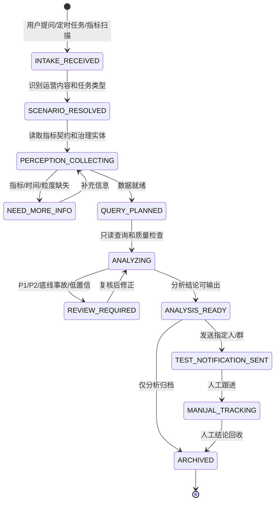

# 人审运营日常事项场景包与 MVP 范围修正

## 1. 背景

基于当前补充的人审运营日常工作内容，现有架构需要做范围修正：

- 当前阶段重点放在前两个节点：感知和分析。
- 通知模块前期不深入建设动态 Owner 路由，测试阶段发送给指定人或指定群。
- 解决模块前期不深入建设自动处理、复杂 SLA 和多级闭环，只做轻量记录、人工跟进和结论回收。
- 每项运营内容仍然在根目录 `human_review_ops/references/scenarios/` 中独立维护自己的状态机、SLA、Owner 路由、通知模板和解决闭环规则；前期 TRAE 调试时可同步到对应 Skill 包内。

## 2. 已识别运营内容

### 2.1 效率模块：机审策略有效性

关注目标：

- 打标率。
- 自动处置准确率。
- 后续可扩展过程指标，例如策略审量、打标量、自动处置量、策略覆盖、策略版本、风险域分布、三级标签分布。

已识别工作内容：

| 运营事项 | 类型 | 输入 | 输出 | 当前重点 |
| --- | --- | --- | --- | --- |
| 日常低准分析 | 日常分析 | 指标数据集、自然语言分析问题 | 整体统计、风险域统计、数据明细、波动归因报告 | 感知 + 分析 |
| 周度推送 | 周期推送 | 指标数据集、推送规则、三级标签与治理 BP 映射 | AI Summary 飞书卡片，触达到指定对象 | 感知 + 分析，通知轻量 |
| 打标率撞线预警 | 撞线预警 | 指标数据集、低效策略定级/升级规则、三级标签与治理 BP 映射 | AI Summary 飞书卡片，触达到指定对象 | 感知 + 分析，通知轻量 |
| 自动处置准确率撞线预警 | 撞线预警 | 指标数据集、低效自动处置策略定级/升级规则、三级标签与治理 BP 映射 | AI Summary 飞书卡片，触达到指定对象 | 感知 + 分析，通知轻量 |

典型规则：

- P2：单日打标率或自动处置准确率异常下降，触达治理运营或人审运营。
- P1：连续两周未提升、低于阈值或策略超过一定时间未提升/未下线，扩大范围触达负责人 +1。

### 2.2 质量模块：质量监控

关注目标：

- 质检准确率。
- 后续可扩展过程指标，例如质检量、误判量、漏判量、风险域维度、队列维度、CQC 质量负责人维度。

已识别工作内容：

| 运营事项 | 类型 | 输入 | 输出 | 当前重点 |
| --- | --- | --- | --- | --- |
| 日常质量分析 | 日常分析 | 指标数据集、自然语言分析问题 | 整体统计、风险域统计、数据明细、波动归因报告 | 感知 + 分析 |
| 质量撞线预警推送 | 撞线预警 | 指标数据集、定级/升级规则 | AI Summary 飞书卡片，触达到指定对象 | 感知 + 分析，通知轻量 |

典型规则：

- P2：整体或风险域单周不达标，推送 CQC 群组质量负责人、人审运营。
- P1：整体或风险域连续两周不达标，推送 CQC 群组负责人、人审运营 +1。

### 2.3 质量模块：底线事故监控

关注目标：

- 底线事故数。
- 后续可扩展过程指标，例如事故类型、漏放量、风险域、队列、S23/S01 等事故分层。

已识别工作内容：

| 运营事项 | 类型 | 输入 | 输出 | 当前重点 |
| --- | --- | --- | --- | --- |
| 底线事故撞线预警推送 | 撞线预警 | 指标数据集、定级/升级规则 | AI Summary 飞书卡片，触达到指定对象 | 感知 + 分析，通知轻量 |

典型规则：

- P2：S23 非底线事故，推送 CQC 群组质量负责人、人审运营。
- P1：S01 非 N1、LS 的底线事故漏放，推送 CQC 群组负责人、人审运营 +1。

## 3. 场景流程包要求

每项运营内容都应作为根目录场景流程包中的一个独立 `scenario_key` 建设，并在 TRAE 调试或发布时生成到各 Skill 自己的 `human_review_ops/skills/{skill}/references/scenarios/`，再由该 Skill 的 `references/scenario-index.md` 挂载。

```text
human_review_ops/references/scenarios/{scenario}/
  perception.md
  analysis.md
  notification.md
  resolution.md
  state_machine.md
  sla.md
  metric_contract.md
  owner_routing.md
  notification_templates.md
  tool_policy.md
  examples.md
```

当前优先建设程度：

| 文件 | 当前阶段要求 | 后续完善 |
| --- | --- | --- |
| `metric_contract.md` | 必须完整，定义核心指标、粒度、过滤条件、数据源、刷新要求 | 增加更多过程指标和数据血缘 |
| `perception.md` | 必须完整，定义如何识别场景、数据就绪、证据要求 | 增加更多异常边界和样例 |
| `analysis.md` | 必须完整，定义分析模板、规则命中、归因和 QueryPlan | 增加复杂归因、拆解方法和复核规则 |
| `state_machine.md` | 先覆盖日常分析、周期推送、撞线预警三类轻量状态机 | 后续补完整通知和解决闭环 |
| `sla.md` | 先定义分析产出时效和测试通知时效 | 后续补 Owner 响应、处理、结论回收 SLA |
| `owner_routing.md` | 先记录路由维度和未来映射逻辑，测试阶段不强依赖 | 后续接入策略、队列、数据资产、系统等找人数据 |
| `notification_templates.md` | 先定义测试群/指定人的卡片模板 | 后续补 P1/P2、多级升级和分角色模板 |
| `resolution.md` | 先定义人工跟进和结论回收字段 | 后续补自动催办、升级、处理结果复查 |
| `tool_policy.md` | 必须完整，定义 Aeolus/Hive、Base、飞书、CLI 等可用能力 | 后续补权限分级和自动执行边界 |
| `examples.md` | 必须提供 3-5 个验收样例 | 后续沉淀回测集和纠错样例 |

## 4. MVP 能力边界

### 4.1 当前重点：感知

感知模块当前必须做好：

- 判断输入属于哪项运营内容：效率/机审策略有效性、质量监控、底线事故监控。
- 判断任务类型：日常分析、周期推送、撞线预警、临时问答。
- 抽取指标概念：打标率、自动处置准确率、质检准确率、底线事故数。
- 识别分析粒度：整体、风险域、三级标签、策略、队列、治理 BP、CQC 负责人。
- 读取场景指标契约。
- 优先映射语义层或治理数据集。
- 输出证据包、数据就绪等级、治理实体和 QueryPlan 前置材料。

### 4.2 当前重点：分析

分析模块当前必须做好：

- 生成 QueryPlan。
- 按指标契约只读查询。
- 输出整体统计、分风险域统计、数据明细。
- 输出波动归因报告。
- 命中定级规则和升级规则，但只作为分析结论或建议，不直接执行复杂升级。
- 输出来源脚注、数据新鲜度、Owner、置信度。
- 对 P1/P2、底线事故、负责人 +1 建议进行对抗性复核。

### 4.3 当前轻量：通知

通知模块当前只做按需测试能力。查询类问题不默认生成通知草稿或 Owner 建议，只有用户明确要求通知/找人，或分析结果触发治理、升级、跟进条件时才进入通知模块。

- 不接入完整动态 Owner 路由。
- 不做复杂多级升级。
- 不自动判断真实负责人。
- 不自动发送到指定人或指定群。
- 消息内容使用 AI Summary 飞书卡片样式。
- 如需生成卡片，可保留“建议 Owner/建议升级对象”，但不作为正式路由结果。

测试阶段通知输出：

```json
{
  "notification_mode": "test_fixed_recipient",
  "fixed_recipients": ["指定人或指定群"],
  "message_type": "ai_summary_card",
  "contains": [
    "场景",
    "指标",
    "定级建议",
    "波动摘要",
    "归因摘要",
    "数据来源",
    "建议 Owner",
    "建议下一步"
  ]
}
```

### 4.4 当前轻量：解决

解决模块当前只做轻量闭环：

- 不做自动处理。
- 不做复杂 SLA 跟进。
- 不做自动升级。
- 只记录人工处理状态、结论和是否需要后续跟进。
- 可把“建议处理动作”作为分析输出的一部分展示。

测试阶段解决输出：

```json
{
  "resolution_mode": "manual_tracking",
  "status": "待人工确认 | 已人工处理 | 需继续观察 | 误报 | 已归档",
  "manual_conclusion": "string",
  "evidence_refs": [],
  "needs_follow_up": true
}
```

## 5. MVP 状态机

当前阶段建议使用轻量状态机，突出感知和分析：



## 6. 对现有文档的更新结论

需要更新/已更新方向：

| 文档 | 需要调整 |
| --- | --- |
| `docs/architecture.md` | 明确 MVP 聚焦感知/分析，通知/解决为轻量测试闭环。 |
| `docs/implementation_plan.md` | 后续开发以 Agent 自身文件、四类 Skill、效率模块样板场景、评估与发布门禁为主线。 |
| `docs/skill_interface_and_tool_mcp_spec.md` | 补充通知/解决的测试模式输入输出。 |
| `docs/data_query_governance.md` | 保持强约束，作为感知/分析的核心规范。 |
| `demo/architecture-preview.html` | 需要展示 MVP 当前重点：感知、分析优先。 |
