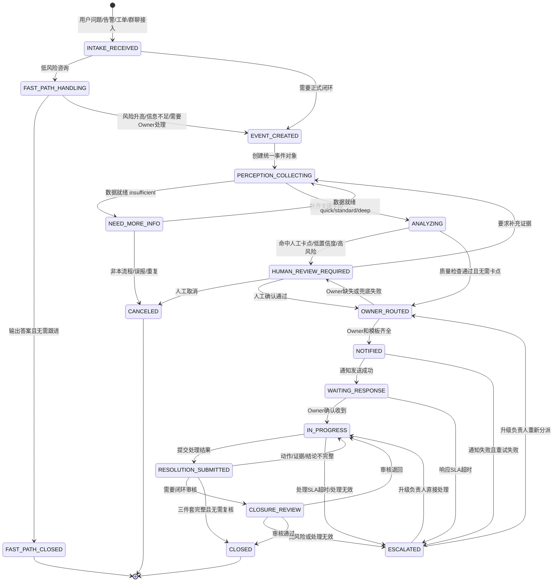

# Skill 接口定义、状态机与 Tool/MCP/CLI 调用规范

## 1. 文档目标

本文基于“方案 1”混合结构，定义人审运营 Agent 编排下的四个通用能力 Skill：

- 感知 Skill
- 分析 Skill
- 通知 Skill
- 解决 Skill

本文同时定义：

- 每个 Skill 的输入输出契约。
- Skill 与场景流程包 reference 的组织方式。
- 从用户问题接入到最终闭环的全生命周期状态机。
- 当前业务场景下必须集成的 Tool/MCP/CLI 清单和调用规范。

核心原则：

- Agent 负责流程编排、状态机、路由、权限、SLA 和升级。
- Skill 负责可复用业务能力和过程逻辑。
- Tool/MCP/CLI 负责原子工具调用、外部系统连接和命令行执行能力。
- reference 不是简单补充知识，而是场景流程包和 Skill 调试快照的组织方式，必须沉淀该运营内容自己的状态机、SLA、Owner 路由、通知模板、SOP、口径、样例和工具边界。

## 2. 方案 1 混合结构：通用能力 Skill + 场景流程包

### 2.1 核心判断

每一项运营内容都默认具备独立的：

- 状态机。
- SLA。
- Owner 路由。
- 通知模板。
- SOP 与判断口径。
- 数据资产和 Tool/MCP/CLI 调用边界。
- 验收样例和历史案例。

因此，本架构中的 reference 不再被视为“场景补充说明”，而是“场景流程包”。通用能力 Skill 负责稳定的方法论和接口，目标态根目录 `references/scenarios/` 负责完整业务事实；前期 TRAE 调试态可把必要文件同步到各 Skill 的 `references/scenarios/`，并由 `references/scenario-index.md` 一级挂载。

### 2.2 推荐目录

```text
references/
  scenarios/
    quality_inspection/
      perception.md
      analysis.md
      notification.md
      resolution.md
      state_machine.md
      sla.md
      metric_contract.md
      owner_routing.md
      notification_templates.md
      tool_policy.md
      examples.md

skills/
  perception/
    SKILL.md
    references/
      common.md
      scenario-index.md
      scenarios/
        quality_inspection.perception.md
        quality_inspection.state_machine.md
        quality_inspection.sla.md
        quality_inspection.metric_contract.md
        quality_inspection.owner_routing.md
        quality_inspection.tool_policy.md
        quality_inspection.examples.md

  analysis/
    SKILL.md
    references/
      common.md
      scenario-index.md
      scenarios/
        quality_inspection.analysis.md
        quality_inspection.state_machine.md
        quality_inspection.sla.md
        quality_inspection.metric_contract.md
        quality_inspection.owner_routing.md
        quality_inspection.tool_policy.md
        quality_inspection.examples.md

  notification/
    SKILL.md
    references/
      common.md
      owner_routing_common.md
      escalation_policy_common.md
      scenario-index.md
      scenarios/
        quality_inspection.notification.md
        quality_inspection.state_machine.md
        quality_inspection.sla.md
        quality_inspection.owner_routing.md
        quality_inspection.notification_templates.md
        quality_inspection.tool_policy.md
        quality_inspection.examples.md

  resolution/
    SKILL.md
    references/
      common.md
      sla_policy_common.md
      closure_standard_common.md
      scenario-index.md
      scenarios/
        quality_inspection.resolution.md
        quality_inspection.state_machine.md
        quality_inspection.sla.md
        quality_inspection.owner_routing.md
        quality_inspection.notification_templates.md
        quality_inspection.tool_policy.md
        quality_inspection.examples.md
```

### 2.3 `SKILL.md` 与场景流程包的职责边界

| 层级 | 放什么 | 不放什么 |
| --- | --- | --- |
| `SKILL.md` | 通用能力目标、触发条件、输入输出契约、执行步骤、质量检查、Tool/MCP/CLI 调用规则、失败降级 | 不写死某个运营场景的所有 SOP 细节，不重复维护大量业务规则 |
| `references/common.md` | 通用术语、统一字段、通用判断口径、共用样例 | 不承载具体场景差异 |
| `references/scenario-index.md` | 每个 Skill 的一级场景索引，直接挂载该 Skill 需要读取的场景文件 | 不承载业务正文，不做二级跳转 |
| 根目录 `references/scenarios/{scenario}/` | 目标态完整场景流程包，包含该运营内容的状态机、SLA、Owner 路由、模板、工具边界、样例 | 不复制通用 Skill 的执行框架 |
| Skill 内 `references/scenarios/{scenario}.{file_type}.md` | 前期 TRAE 调试快照，或未来单 Skill 发布包内文件 | 只能由根目录场景包生成，不能手工漂移 |

### 2.4 场景流程包必备文件

每个运营内容必须具备以下文件。

| 文件 | 必填 | 内容 |
| --- | --- | --- |
| `perception.md` | 是 | 该场景如何识别、必填字段、数据就绪标准、证据要求。 |
| `analysis.md` | 是 | 该场景的影响评估、归因定位、SOP 判定、质量检查口径。 |
| `notification.md` | 是 | 该场景的通知对象、通知条件、消息结构、发送前确认规则。 |
| `resolution.md` | 是 | 该场景的处理动作、闭环三件套、退回/升级/取消规则。 |
| `state_machine.md` | 是 | 该场景独立状态机、状态含义、流转条件、终态标准。 |
| `sla.md` | 是 | 响应 SLA、处理 SLA、结论回收 SLA、超时升级策略。 |
| `metric_contract.md` | 是 | 核心指标、过程指标、分子分母、粒度、过滤条件、允许/禁止数据源、数据刷新和 Owner。 |
| `owner_routing.md` | 是 | 策略、队列、数据资产、系统、业务域等维度的找人逻辑。 |
| `notification_templates.md` | 是 | P0/P1/P2/P3、催办、升级、闭环、补信息等模板。 |
| `tool_policy.md` | 是 | 该场景允许调用的 Tool/MCP/CLI、权限、参数 schema、运行目录、超时、重试、降级。 |
| `examples.md` | 是 | 验收样例、历史案例、正例、反例、回测样例。 |

### 2.5 调用方式

Agent 调用某个通用 Skill 时，必须同时传入 `scenario_package_ref`。前期 TRAE 调试态可指向 Skill 内快照前缀，例如 `references/scenarios/quality_inspection`；目标治理态可通过 `scenario-index.md` 指向根目录 `references/scenarios/quality_inspection/`。

```json
{
  "skill": "analysis",
  "scenario_package_ref": "references/scenarios/quality_inspection",
  "event_id": "EVT-20260707-0001",
  "config_versions": {
    "state_machine": "quality_inspection_state_machine_v1",
    "sla": "quality_inspection_sla_v1",
    "owner_routing": "quality_inspection_owner_routing_v1",
    "notification_templates": "quality_inspection_notification_templates_v1",
    "tool_policy": "quality_inspection_tool_policy_v1"
  }
}
```

## 3. 通用对象契约

四个 Skill 之间通过结构化对象交互，避免自然语言临时拼接。

### 3.1 统一上下文 `OpsContext`

```json
{
  "request_id": "REQ-20260707-0001",
  "event_id": "EVT-20260707-0001",
  "source": {
    "type": "chat | alert | ticket | manual",
    "source_id": "string",
    "raw_content": "string",
    "created_at": "datetime",
    "created_by": "string"
  },
  "scenario_hint": {
    "business_domain": "string",
    "scenario": "string",
    "problem_type": "string"
  },
  "scenario_package_ref": "references/scenarios/{scenario}",
  "operator_context": {
    "current_user": "string",
    "role": "ops_oncall | ops_expert | data_owner | business_owner",
    "locale": "zh-CN"
  },
  "config_versions": {
    "scenario_config_version": "string",
    "workflow_rule_version": "string",
    "owner_mapping_version": "string",
    "template_version": "string"
  },
  "tool_policy": {
    "allowed_tools": [],
    "permission_level": "readonly | writable | confirmation_required | high_risk",
    "timeout_ms": 30000
  }
}
```

### 3.2 证据引用 `EvidenceRef`

```json
{
  "ref_id": "string",
  "ref_type": "metric | sample | sop | case | owner | ticket | doc | tool_call",
  "title": "string",
  "summary": "string",
  "source_url": "string",
  "collected_at": "datetime",
  "confidence": 0.0
}
```

### 3.3 Tool/MCP/CLI 调用记录 `ToolCallRecord`

```json
{
  "tool_call_id": "TOOL-0001",
  "event_id": "EVT-20260707-0001",
  "caller": "agent | perception_skill | analysis_skill | notification_skill | resolution_skill",
  "tool_name": "string",
  "capability_type": "data_query | base_read | base_write | notification | doc_read | ticket | approval | audit | cli_command",
  "permission_level": "readonly | writable | confirmation_required | high_risk",
  "execution_surface": "tool | mcp | cli",
  "command_name": "string",
  "working_directory": "string",
  "input_summary": "string",
  "output_summary": "string",
  "status": "success | failed | timeout | degraded",
  "latency_ms": 0,
  "fallback_action": "string"
}
```

## 4. 感知 Skill 接口定义

### 4.1 定位

感知 Skill 负责把原始问题转化为可分析的事件画像和证据包，回答：

- 这是什么问题？
- 影响什么对象？
- 需要哪些数据和 SOP？
- 当前数据是否足够进入分析？
- 可能应该找谁负责？

### 4.2 `SKILL.md` 应包含的 reference 路径

```markdown
## References
- `references/common.md`
- `references/scenario-index.md`
- `references/scenarios/{scenario}.perception.md`
- `references/scenarios/{scenario}.state_machine.md`
- `references/scenarios/{scenario}.sla.md`
- `references/scenarios/{scenario}.metric_contract.md`
- `references/scenarios/{scenario}.owner_routing.md`
- `references/scenarios/{scenario}.tool_policy.md`
- `references/scenarios/{scenario}.examples.md`
```

### 4.3 输入契约 `PerceptionInput`

```json
{
  "context": {},
  "raw_problem": {
    "content": "string",
    "attachments": [],
    "source_type": "chat | alert | ticket | manual",
    "source_url": "string"
  },
  "scenario_package_ref": "references/scenarios/{scenario}",
  "scenario_candidates": [
    {
      "scenario": "string",
      "problem_type": "string",
      "confidence": 0.0,
      "matched_reason": "string"
    }
  ],
  "required_evidence_policy": {
    "required_fields": [],
    "required_metric_refs": [],
    "required_sop_refs": [],
    "required_owner_refs": []
  },
  "available_tools": [
    "data_query",
    "lark_base_read",
    "doc_read",
    "case_search",
    "owner_lookup"
  ]
}
```

### 4.4 输出契约 `PerceptionOutput`

```json
{
  "event_profile": {
    "business_domain": "string",
    "scenario": "string",
    "problem_type": "string",
    "impact_object": "string",
    "time_range": {
      "start": "datetime",
      "end": "datetime"
    },
    "current_status": "string"
  },
  "evidence_pack": {
    "metrics": [],
    "samples": [],
    "sop_refs": [],
    "case_refs": [],
    "owner_refs": [],
    "tool_call_refs": []
  },
  "readiness": {
    "level": "quick | standard | deep | insufficient",
    "missing_fields": [],
    "confidence": 0.0,
    "reason": "string"
  },
  "routing_candidates": [
    {
      "owner_type": "data_owner | scenario_owner | sop_owner | oncall",
      "owner": "string",
      "confidence": 0.0,
      "source_ref": "string"
    }
  ],
  "next_action": {
    "action": "answer_fast_path | continue_analysis | ask_more_info | cancel",
    "reason": "string"
  }
}
```

### 4.5 执行步骤

1. 解析来源类型和原始问题。
2. 识别候选业务场景和问题类型。
3. 根据 `scenario_package_ref` 读取该运营内容的场景流程包，包括必填字段、独立状态机、SLA、Owner 路由、通知模板、SOP、指标契约和工具边界。
4. 优先映射语义层/指标注册表，读取 `metric_contract.md` 限定允许指标、粒度、过滤条件和禁止数据源。
5. 通过 Tool/MCP/CLI 只读拉取指标、SOP、Owner、历史案例。
6. 检查数据新鲜度、完整性、口径版本和 Owner。
7. 形成事件画像、证据包和治理实体映射结果。
8. 判断数据就绪等级。
9. 输出下一步动作建议。

### 4.6 质量检查

| 检查项 | 通过标准 | 失败处理 |
| --- | --- | --- |
| 场景识别 | 至少有一个候选场景且置信度可解释 | 进入 `NEED_MORE_INFO` 或人工确认 |
| 时间范围 | 能确定分析时间范围 | 要求补充时间或使用场景默认范围 |
| 关键证据 | 至少有指标、SOP、Owner 中的一类证据 | 标记 `insufficient` |
| Owner 候选 | 能找到主 Owner 或兜底 Owner | 进入人工指定 Owner |
| 工具审计 | 所有 Tool/MCP/CLI 调用有记录 | 阻断进入自动通知 |
| 语义层优先 | 能命中治理指标时必须使用语义层或指标契约 | 阻断自由查表 |
| 数据新鲜度 | 最新分区和刷新时间满足场景要求 | 降低置信度或进入人工确认 |

## 5. 分析 Skill 接口定义

### 5.1 定位

分析 Skill 负责基于事件画像和证据包产出可解释结论，回答：

- 影响范围是什么？
- 可能根因是什么？
- 按 SOP 应如何定级？
- 下一步应该通知、补信息、监控、升级还是人工确认？

### 5.2 `SKILL.md` 应包含的 reference 路径

```markdown
## References
- `references/common.md`
- `references/scenario-index.md`
- `references/scenarios/{scenario}.analysis.md`
- `references/scenarios/{scenario}.state_machine.md`
- `references/scenarios/{scenario}.sla.md`
- `references/scenarios/{scenario}.metric_contract.md`
- `references/scenarios/{scenario}.owner_routing.md`
- `references/scenarios/{scenario}.tool_policy.md`
- `references/scenarios/{scenario}.examples.md`
```

### 5.3 输入契约 `AnalysisInput`

```json
{
  "context": {},
  "scenario_package_ref": "references/scenarios/{scenario}",
  "event_profile": {},
  "evidence_pack": {},
  "readiness": {
    "level": "quick | standard | deep | insufficient",
    "missing_fields": [],
    "confidence": 0.0
  },
  "analysis_policy": {
    "templates": [
      "impact_assessment",
      "root_cause",
      "sop_decision"
    ],
    "allow_custom_readonly_query": true,
    "required_quality_checks": [
      "evidence_complete",
      "data_fresh",
      "metric_definition_consistent",
      "owner_resolved"
    ]
  },
  "available_tools": [
    "data_query",
    "case_search",
    "doc_read"
  ]
}
```

### 5.4 输出契约 `AnalysisOutput`

```json
{
  "analysis_id": "ANA-0001",
  "event_id": "EVT-20260707-0001",
  "templates_used": [
    "impact_assessment",
    "root_cause",
    "sop_decision"
  ],
  "query_plan": {
    "query_plan_id": "QP-0001",
    "metric_entities": [],
    "dimensions": [],
    "time_range": {},
    "filters": [],
    "allowed_sources": [],
    "forbidden_sources": [],
    "quality_checks": []
  },
  "impact_assessment": {
    "summary": "string",
    "impact_scope": "string",
    "risk_level": "P0 | P1 | P2 | P3 | unknown",
    "business_risk": "string",
    "duration": "string",
    "evidence_refs": []
  },
  "root_cause_hypotheses": [
    {
      "hypothesis": "string",
      "confidence": 0.0,
      "supporting_evidence": [],
      "contradicting_evidence": [],
      "next_check": "string"
    }
  ],
  "sop_decision": {
    "severity_level": "P0 | P1 | P2 | P3",
    "next_action": "answer | notify | ask_more | monitor | execute_with_confirmation | escalate",
    "required_confirmation": true,
    "matched_rules": [],
    "reason": "string"
  },
  "quality_checks": {
    "evidence_complete": true,
    "data_fresh": true,
    "metric_definition_consistent": true,
    "owner_resolved": true,
    "confidence": 0.0,
    "warnings": []
  },
  "source_footer": {
    "source_tier": "semantic_layer | governed_dataset | scenario_reference | readonly_exploration",
    "metric_definition_version": "string",
    "data_freshness": "string",
    "owner": "string",
    "confidence_tier": "high | medium | low",
    "review_status": "not_reviewed | auto_reviewed | human_reviewed"
  },
  "tool_call_refs": []
}
```

### 5.5 执行步骤

1. 检查数据就绪等级，`insufficient` 不进入标准分析。
2. 按 `scenario_package_ref` 读取该运营内容的指标契约、分析模板、独立状态机、SLA、Owner 路由和工具边界。
3. 基于感知输出的治理实体生成 `QueryPlan`，明确指标、粒度、时间范围、过滤条件、允许/禁止数据源。
4. 执行影响评估。
5. 执行归因定位，输出候选根因而不是单点断言。
6. 执行 SOP 判定，输出等级、动作建议和是否需要人工确认。
7. 必要时发起只读自定义分析或白名单 CLI 诊断命令，并记录 Tool/MCP/CLI 调用。
8. 执行数据质量检查和高风险对抗性复核。
9. 输出质量检查结果和来源脚注。

### 5.6 质量检查

| 检查项 | 通过标准 | 失败处理 |
| --- | --- | --- |
| 证据完整 | 每个关键结论有证据引用 | 标记低置信度，进入人工确认 |
| 指标口径一致 | 使用指标与场景流程包口径一致 | 退回感知补充或人工确认 |
| 归因可解释 | 根因有支持证据和反证说明 | 输出候选根因，不允许直接闭环 |
| SOP 命中 | 等级和动作建议能引用规则 | 进入人工确认 |
| 自定义分析边界 | 仅只读查询，无状态变更 | 违规调用必须阻断 |
| 查询计划 | 查询前有 `QueryPlan` 且命中治理实体 | 无计划不得执行查询 |
| 来源脚注 | 输出包含来源层级、刷新时间、Owner、口径版本、置信度 | 缺失脚注不得进入自动通知 |
| 对抗复核 | 高风险 P1/P2、底线事故、负责人 +1 推送已复核 | 未复核不得标记高置信 |

## 6. 通知 Skill 接口定义

### 6.1 定位

通知 Skill 负责把分析结论转化为正确的通知对象、通知内容、SLA 截止时间和升级策略，回答：

- 应该通知谁？
- 用什么渠道通知？
- 通知内容包含哪些证据和要求动作？
- 何时催办或升级？

### 6.2 `SKILL.md` 应包含的 reference 路径

```markdown
## References
- `references/common.md`
- `references/owner_routing_common.md`
- `references/escalation_policy_common.md`
- `references/scenario-index.md`
- `references/scenarios/{scenario}.notification.md`
- `references/scenarios/{scenario}.state_machine.md`
- `references/scenarios/{scenario}.sla.md`
- `references/scenarios/{scenario}.owner_routing.md`
- `references/scenarios/{scenario}.notification_templates.md`
- `references/scenarios/{scenario}.tool_policy.md`
- `references/scenarios/{scenario}.examples.md`
```

### 6.3 输入契约 `NotificationInput`

```json
{
  "context": {},
  "scenario_package_ref": "references/scenarios/{scenario}",
  "event_profile": {},
  "analysis_result": {},
  "routing_candidates": [],
  "notification_policy": {
    "mode": "mvp_test_fixed_recipient | dynamic_owner_routing",
    "fixed_recipients": [],
    "primary_route": "data_owner",
    "fallback_order": [
      "scenario_owner",
      "sop_owner",
      "backup_owner",
      "oncall"
    ],
    "template_id": "string",
    "require_review_before_send": true
  },
  "sla_policy": {
    "response_due_at": "datetime",
    "resolution_due_at": "datetime",
    "closure_due_at": "datetime"
  },
  "available_tools": [
    "lark_im_send",
    "ticket_create",
    "base_write",
    "audit_log"
  ]
}
```

### 6.4 输出契约 `NotificationOutput`

```json
{
  "notification_id": "NTF-0001",
  "event_id": "EVT-20260707-0001",
  "route": {
    "mode": "mvp_test_fixed_recipient | dynamic_owner_routing",
    "fixed_recipients": [],
    "primary_recipient": {
      "role": "data_owner",
      "user": "string",
      "channel": "lark"
    },
    "backup_recipients": [],
    "escalation_chain": []
  },
  "message": {
    "title": "string",
    "summary": "string",
    "required_action": "string",
    "deadline": "datetime",
    "evidence_refs": [],
    "risk_level": "P0 | P1 | P2 | P3"
  },
  "suggested_route": {
    "suggested_owner": "string",
    "suggested_escalation_target": "string",
    "routing_evidence": []
  },
  "delivery_plan": {
    "send_now": true,
    "requires_human_review": true,
    "reason": "string"
  },
  "delivery_status": {
    "status": "pending | sent | acknowledged | failed",
    "sent_at": "datetime",
    "acknowledged_at": "datetime",
    "failure_reason": "string"
  },
  "escalation_policy": {
    "triggers": [
      "sla_timeout",
      "severity",
      "repeat_failure",
      "manual_mark"
    ],
    "next_recipients": []
  },
  "tool_call_refs": []
}
```

### 6.5 执行步骤

1. 校验分析结果是否达到通知条件。
2. 如果 `mode=mvp_test_fixed_recipient`，只发送给指定人或指定群；动态 Owner 路由只作为 suggested_route 展示。
3. 如果 `mode=dynamic_owner_routing`，根据数据 Owner 优先路由，按兜底顺序补齐备份人和升级链路。
4. 根据该运营内容的 `notification_templates.md` 和事件等级选择通知模板。
5. 生成通知标题、摘要、证据、要求动作和截止时间。
6. 判断是否需要发送前人工确认。
7. 调用通知 Tool/MCP 发送，或在白名单 CLI 场景下执行通知/同步命令，或返回待确认状态。
8. 写入通知状态和审计记录。

### 6.6 质量检查

| 检查项 | 通过标准 | 失败处理 |
| --- | --- | --- |
| Owner 正确 | MVP 阶段仅校验建议 Owner 有依据；正式阶段要求主 Owner 来自数据 Owner 表或明确兜底规则 | MVP 不阻断发送，正式阶段进入人工指定 Owner |
| 模板完整 | 标题、摘要、证据、动作、截止时间齐全 | 阻断发送 |
| 证据齐全 | 通知中引用关键证据 | 阻断自动发送或人工确认 |
| SLA 明确 | 响应、处理、结论回收时限明确 | 使用场景默认 SLA 或人工确认 |
| 发送可追踪 | 通知 Tool 返回状态并写入审计 | 失败重试或升级 |

## 7. 解决 Skill 接口定义

### 7.1 定位

解决 Skill 负责推进处理、催办、升级、回收结论和闭环判定，回答：

- 当前是否已响应？
- 是否超 SLA？
- 处理动作是否完成？
- 证据是否足够关闭？
- 是否需要进入迭代候选池？

### 7.2 `SKILL.md` 应包含的 reference 路径

```markdown
## References
- `references/common.md`
- `references/sla_policy_common.md`
- `references/closure_standard_common.md`
- `references/scenario-index.md`
- `references/scenarios/{scenario}.resolution.md`
- `references/scenarios/{scenario}.state_machine.md`
- `references/scenarios/{scenario}.sla.md`
- `references/scenarios/{scenario}.owner_routing.md`
- `references/scenarios/{scenario}.notification_templates.md`
- `references/scenarios/{scenario}.tool_policy.md`
- `references/scenarios/{scenario}.examples.md`
```

### 7.3 输入契约 `ResolutionInput`

```json
{
  "context": {},
  "scenario_package_ref": "references/scenarios/{scenario}",
  "event_profile": {},
  "analysis_result": {},
  "notification_status": {},
  "workflow_state": "WAITING_RESPONSE | IN_PROGRESS | ESCALATED | RESOLUTION_SUBMITTED | CLOSURE_REVIEW",
  "sla_status": {
    "response_status": "within_sla | timeout | not_applicable",
    "resolution_status": "within_sla | timeout | not_applicable",
    "closure_status": "within_sla | timeout | not_applicable"
  },
  "permission_policy": {
    "mode": "mvp_manual_tracking | full_resolution_workflow",
    "allowed_actions": [],
    "forbidden_actions": [],
    "requires_confirmation": true,
    "reviewer_role": "ops_oncall | ops_expert | data_owner | business_owner"
  },
  "submitted_resolution": {
    "manual_status": "待人工确认 | 已人工处理 | 需继续观察 | 误报 | 已归档",
    "action_summary": "string",
    "root_cause": "string",
    "impact_scope": "string",
    "evidence_refs": [],
    "final_conclusion": "string"
  },
  "available_tools": [
    "lark_im_send",
    "ticket_update",
    "base_write",
    "audit_log"
  ]
}
```

### 7.4 输出契约 `ResolutionOutput`

```json
{
  "resolution_id": "RES-0001",
  "event_id": "EVT-20260707-0001",
  "actions": [
    {
      "action_id": "ACT-0001",
      "action_type": "notify | remind | escalate | execute | rollback | record | ask_more | close",
      "executor": "agent | human",
      "requires_confirmation": true,
      "confirmed_by": "string",
      "status": "pending | done | failed | canceled",
      "result_summary": "string"
    }
  ],
  "manual_tracking": {
    "mode": "mvp_manual_tracking | full_resolution_workflow",
    "status": "待人工确认 | 已人工处理 | 需继续观察 | 误报 | 已归档",
    "manual_conclusion": "string",
    "needs_follow_up": true
  },
  "closure": {
    "action_completed": true,
    "evidence_confirmed": true,
    "conclusion_recorded": true,
    "root_cause": "string",
    "impact_scope": "string",
    "final_conclusion": "string",
    "evidence_refs": [],
    "closed_by": "string",
    "closed_at": "datetime"
  },
  "next_state": "IN_PROGRESS | ESCALATED | CLOSURE_REVIEW | CLOSED",
  "follow_up": {
    "needs_iteration": true,
    "iteration_reasons": [],
    "abnormal_flags": [],
    "next_review_owner": "string"
  },
  "tool_call_refs": []
}
```

### 7.5 执行步骤

1. 根据该运营内容的 `state_machine.md` 和 `sla.md` 检查当前状态和 SLA 状态。
2. 如果 `mode=mvp_manual_tracking`，只记录人工状态、人工结论、证据引用和是否继续观察。
3. 如果 `mode=full_resolution_workflow`，响应、处理或结论回收超时时生成催办或升级动作。
4. 如果责任人提交处理结果，检查闭环三件套。
5. 如果证据不足或结论不完整，退回 `IN_PROGRESS`。
6. 如果场景或等级要求闭环审核，进入 `CLOSURE_REVIEW`。
7. 如果闭环条件满足，写入处理结果表和历史案例表。
8. 判断是否触发迭代候选池。

### 7.6 质量检查

| 检查项 | 通过标准 | 失败处理 |
| --- | --- | --- |
| 动作完成 | 有明确处理动作、处理人、处理时间 | 退回处理 |
| 证据确认 | 有数据、样本、复核或人工确认依据 | 退回补证据 |
| 结论沉淀 | 根因、影响范围、最终结论齐全 | 退回补结论 |
| SLA 处理 | MVP 阶段只记录超时和建议动作；正式阶段超时能催办或升级 | MVP 不自动升级，正式阶段标记 SLA 失败并升级 |
| 迭代判断 | 人工纠错、重复问题、SLA 失败、效果退化被标记 | 写入迭代候选池 |

## 8. 全生命周期状态机流转图

### 8.1 Mermaid 状态图



### 8.2 状态与 Skill/Tool 关系

| 状态 | 主要责任方 | 主要 Skill | 主要 Tool/MCP/CLI | 关键产物 |
| --- | --- | --- | --- | --- |
| `INTAKE_RECEIVED` | Agent | 无 | 消息/告警/工单读取 Tool | 原始输入 |
| `FAST_PATH_HANDLING` | Agent | 感知、分析 | 文档读取、轻量数据查询 Tool | 快路径答案 |
| `EVENT_CREATED` | Agent | 感知 | Base 写入 Tool | 统一事件对象 |
| `PERCEPTION_COLLECTING` | Agent + 感知 Skill | 感知 | 数据查询、SOP 文档、Owner 查询、案例检索 | 事件画像、证据包 |
| `NEED_MORE_INFO` | 运营值班 | 感知 | 通知 Tool、Base 写入 Tool | 补充信息请求 |
| `ANALYZING` | Agent + 分析 Skill | 分析 | 数据查询、案例检索、文档读取 | 分析结果 |
| `HUMAN_REVIEW_REQUIRED` | 运营专家/值班 | 分析、通知、解决 | Base 写入、通知 Tool | 人工确认记录 |
| `OWNER_ROUTED` | Agent + 通知 Skill | 通知 | Owner 查询、Base 写入 | 路由结果 |
| `NOTIFIED` | Agent + 通知 Skill | 通知 | 飞书通知、工单 Tool | 通知记录 |
| `WAITING_RESPONSE` | 数据 Owner | 通知、解决 | 通知状态查询、催办 Tool | 响应状态 |
| `IN_PROGRESS` | 数据 Owner | 解决 | 工单更新、Base 写入、通知 Tool | 处理进展 |
| `ESCALATED` | 升级负责人 | 通知、解决 | 升级通知、工单 Tool | 升级记录 |
| `RESOLUTION_SUBMITTED` | 数据 Owner | 解决 | Base 写入、证据上传/引用 Tool | 处理结果 |
| `CLOSURE_REVIEW` | 运营专家/值班 | 解决 | Base 写入、审计 Tool | 闭环审核 |
| `CLOSED` | 运营专家/值班 | 解决 | Base 写入、案例沉淀、审计 Tool | 闭环记录、历史案例 |
| `CANCELED` | 运营值班 | 感知/解决 | Base 写入、审计 Tool | 取消原因 |

## 9. Tool/MCP/CLI 必接清单与调用规范

### 9.1 必接工具清单

| 工具类别 | 必接工具 | 主要用途 | 权限级别 | 典型调用方 |
| --- | --- | --- | --- | --- |
| 多源入口 | 消息/群聊读取 Tool | 读取自然语言问题、群聊上下文、消息链接 | 只读 | Agent、感知 Skill |
| 多源入口 | 告警读取 Tool | 接入监控或指标异常告警 | 只读 | Agent、感知 Skill |
| 多源入口 | 工单读取 Tool | 读取工单内容、状态、处理人 | 只读 | Agent、感知 Skill |
| 数据查询 | 指标查询 Tool | 查询核心业务指标、趋势、阈值 | 只读 | 感知 Skill、分析 Skill |
| 数据查询 | 明细/样本查询 Tool | 查询受影响样本、任务、队列、对象明细 | 只读 | 感知 Skill、分析 Skill |
| 知识读取 | SOP/文档读取 Tool | 读取流程规则、判断口径、处理规范 | 只读 | 感知 Skill、分析 Skill |
| 知识读取 | 历史案例检索 Tool | 检索相似问题、历史根因、处理方式 | 只读 | 感知 Skill、分析 Skill |
| 责任路由 | Owner 查询 Tool | 按数据资产、指标、策略、系统匹配负责人 | 只读 | 感知 Skill、通知 Skill |
| 配置存储 | Lark Base 读取 Tool | 读取场景、流程规则、模板、SLA、Owner 配置 | 只读 | Agent、全部 Skill |
| 配置存储 | Lark Base 写入 Tool | 写入事件、通知、处理结果、验收样例、案例 | 可写/需确认 | Agent、通知 Skill、解决 Skill |
| 通知协同 | 飞书消息发送 Tool | 通知 Owner、催办、升级 | 需确认/可写 | 通知 Skill、解决 Skill |
| 通知协同 | 群通知 Tool | 向运营群、战情群同步事件状态 | 需确认/可写 | 通知 Skill、解决 Skill |
| 工单协同 | 工单创建/更新 Tool | 创建跟进单、更新处理状态和结论 | 需确认/可写 | 解决 Skill |
| 审批协同 | 审批状态查询 Tool | 查询审批状态，不替代审批 | 只读 | 解决 Skill |
| 审计观测 | 工具调用审计 Tool | 记录所有 Tool/MCP 调用链路 | 可写 | Agent、全部 Skill |
| 审计观测 | 状态变更审计 Tool | 记录状态机流转、人工卡点、升级和关闭 | 可写 | Agent、解决 Skill |
| CLI 执行 | CLI Runner | 执行预注册命令，例如数据导出、配置校验、回测、巡检、诊断 | 只读/需确认 | Agent、感知 Skill、分析 Skill、解决 Skill |
| CLI 执行 | 回测 CLI | 运行历史样例回测、生成效果对比 | 只读/可写审计 | Agent、分析 Skill |
| CLI 执行 | 配置校验 CLI | 校验场景流程包、Base 配置、Owner 映射、通知模板完整性 | 只读 | Agent、全部 Skill |
| CLI 执行 | 数据导出 CLI | 导出指标明细、样本、回测结果或审计摘要 | 只读/需确认 | 感知 Skill、分析 Skill |

### 9.2 MCP Server 与 CLI Runner 建议分组

| MCP Server | 暴露能力 | 说明 |
| --- | --- | --- |
| `ops-entry-mcp` | 消息读取、告警读取、工单读取 | 统一多源入口读取能力。 |
| `ops-data-mcp` | 指标查询、明细查询、样本查询 | 默认只读，必须记录口径和时间范围。 |
| `ops-knowledge-mcp` | SOP 文档读取、历史案例检索、复盘文档读取 | 所有结论必须保留来源引用。 |
| `ops-config-mcp` | Lark Base 配置读取、事件写入、结果写入 | 写入需要版本、操作者和审计记录。 |
| `ops-notify-mcp` | 飞书单聊、群通知、催办、升级通知 | 发送前检查模板、Owner、SLA、人工卡点。 |
| `ops-ticket-mcp` | 工单创建、工单更新、工单状态查询 | 不替代审批，不直接执行高风险动作。 |
| `ops-audit-mcp` | 工具调用日志、状态变更日志、失败降级日志 | 全链路审计和后续回测依赖。 |
| `ops-cli-runner` | 白名单 CLI 执行、回测、配置校验、数据导出、巡检 | 只允许预注册命令和结构化参数，不允许自由拼接 shell。 |

### 9.3 通用调用规范

所有 Tool/MCP/CLI 调用必须遵守以下规范。

#### 9.3.1 调用前检查

| 检查项 | 要求 |
| --- | --- |
| 工具是否在白名单 | 只能调用 `tool_policy.allowed_tools` 中的工具。 |
| 权限是否匹配 | 只读、可写、需确认、高风险必须匹配当前场景权限。 |
| 参数是否完整 | 必填参数缺失时不调用，进入补信息或降级。 |
| 是否需要人工确认 | 通知、写入、工单创建、高风险执行前检查人工卡点。 |
| 是否有超时策略 | 每个调用必须有 timeout 和 fallback。 |
| CLI 是否预注册 | CLI 只能执行 `tool_policy.allowed_cli_commands` 中的命令。 |
| CLI 参数是否结构化 | CLI 参数必须来自 schema，不允许拼接自由文本 shell。 |
| CLI 运行目录是否受限 | CLI 必须在预设工作目录运行，禁止任意 `cd` 或访问未授权路径。 |

#### 9.3.2 调用中约束

| 约束 | 要求 |
| --- | --- |
| 最小权限 | 能只读不写入，能查询不变更。 |
| 最小数据范围 | 查询必须带时间范围、业务域、对象范围。 |
| 幂等写入 | 写入事件、通知、结果时必须携带 `event_id` 和幂等 key。 |
| 敏感信息处理 | 审计日志只记录摘要，不记录不必要的明文敏感信息。 |
| 重试限制 | 只允许对幂等或只读调用自动重试。 |
| CLI 输出限制 | CLI 输出必须限制大小，必要时只保留摘要、文件路径和关键错误。 |
| CLI 脱敏 | CLI 输出进入上下文或审计前必须脱敏，不能泄露凭据、个人敏感信息或未授权数据。 |

#### 9.3.3 调用后处理

| 处理项 | 要求 |
| --- | --- |
| 写入调用记录 | 必须生成 `ToolCallRecord`，CLI 调用需额外记录 `command_name`、`working_directory` 和退出码。 |
| 结果结构化 | Tool 返回结果必须转成 EvidenceRef、事件字段或处理结果字段。 |
| 失败降级 | 失败、超时、权限不足必须给出 fallback_action。 |
| 状态机联动 | 关键调用结果可能触发状态流转，例如通知成功进入 `WAITING_RESPONSE`。 |
| 可回放 | 审计信息应支持后续定位调用链路和构建回测样例。 |

### 9.4 各类工具调用示例

#### 数据查询 Tool

```json
{
  "tool_name": "data_query.metric_trend",
  "permission_level": "readonly",
  "input": {
    "metric_code": "audit_error_rate",
    "time_range": {
      "start": "2026-07-07T00:00:00+08:00",
      "end": "2026-07-07T12:00:00+08:00"
    },
    "dimensions": ["queue", "policy"],
    "filters": {
      "business_domain": "human_review"
    }
  },
  "required_audit": true
}
```

返回结果必须转成 `EvidenceRef`，并记录指标口径、时间范围和查询摘要。

#### Lark Base 写入 Tool

```json
{
  "tool_name": "lark_base.event_record.upsert",
  "permission_level": "writable",
  "input": {
    "event_id": "EVT-20260707-0001",
    "idempotency_key": "EVT-20260707-0001:STATE:ANALYZING",
    "workflow_state": "ANALYZING",
    "current_owner": "string",
    "evidence_links": []
  },
  "required_audit": true
}
```

写入配置类数据必须带版本；写入事件状态必须带状态、触发原因和操作者。

#### 飞书通知 Tool

```json
{
  "tool_name": "lark_im.send_message",
  "permission_level": "confirmation_required",
  "input": {
    "recipient": "data_owner_open_id",
    "message_template_id": "TPL-P1-DATA-OWNER",
    "event_id": "EVT-20260707-0001",
    "summary": "string",
    "required_action": "请在响应 SLA 前确认处理计划",
    "deadline": "datetime",
    "evidence_refs": []
  },
  "required_audit": true
}
```

发送前必须检查 Owner、模板、证据、SLA 和人工卡点。

#### 工单 Tool

```json
{
  "tool_name": "ticket.create_or_update",
  "permission_level": "confirmation_required",
  "input": {
    "event_id": "EVT-20260707-0001",
    "title": "string",
    "owner": "string",
    "severity": "P1",
    "description": "string",
    "evidence_refs": []
  },
  "required_audit": true
}
```

工单 Tool 只负责协同和记录，不绕过审批，不自动执行高风险变更。

#### CLI Runner

```json
{
  "tool_name": "cli_runner.execute",
  "execution_surface": "cli",
  "permission_level": "readonly",
  "input": {
    "command_name": "ops-regression-run",
    "working_directory": "/workspace/human-review-ops",
    "args": {
      "scenario": "quality_inspection",
      "sample_set": "baseline_v1",
      "output": "reports/regression_quality_inspection_v1.json"
    },
    "timeout_ms": 120000,
    "max_output_bytes": 20000
  },
  "required_audit": true
}
```

CLI 调用要求：

- `command_name` 必须来自白名单，不允许直接传入任意 shell 片段。
- `args` 必须按 schema 校验，禁止字符串拼接命令。
- `working_directory` 必须是预设目录。
- 默认只读；涉及写入、发布、删除、变更配置时必须人工确认。
- stdout/stderr 只保留摘要和关键错误，完整文件通过受控路径引用。

### 9.5 Tool/MCP/CLI 失败降级规范

| 失败类型 | 降级动作 | 状态机影响 |
| --- | --- | --- |
| 数据查询失败 | 使用已有证据降级分析，标记置信度下降 | 可能进入 `HUMAN_REVIEW_REQUIRED` |
| SOP 文档读取失败 | 使用缓存规则或要求人工确认 | 可能进入 `HUMAN_REVIEW_REQUIRED` |
| Owner 查询失败 | 回退场景 Owner、备份人或值班机制 | 可能进入 `HUMAN_REVIEW_REQUIRED` |
| 通知发送失败 | 重试、切换渠道、通知备份人 | 可能进入 `ESCALATED` |
| Base 写入失败 | 保留本地审计摘要并重试，阻断关闭 | 不允许进入 `CLOSED` |
| 工单创建失败 | 通过通知 Tool 人工跟进，并记录失败原因 | 进入 `IN_PROGRESS` 或 `ESCALATED` |
| 审计写入失败 | 降级记录最小日志，阻断高风险动作 | 高风险动作不得继续 |
| CLI 命令失败 | 记录退出码、错误摘要、命令名和参数摘要，必要时回退人工执行 | 视场景进入 `HUMAN_REVIEW_REQUIRED` 或保持原状态 |
| CLI 输出超限 | 截断输出，保留报告文件路径和摘要 | 不影响状态，除非关键结果缺失 |
| CLI 权限不足 | 不重试，提示权限申请或改走人工流程 | 进入 `HUMAN_REVIEW_REQUIRED` |

## 10. 后续落地检查清单

创建真实 Skill 前，需要逐项确认：

| 检查项 | 要求 |
| --- | --- |
| Skill 目录 | 四个通用能力 Skill 目录存在。 |
| SKILL.md | 每个 Skill 有触发条件、输入输出、执行步骤、质量检查、Tool/MCP/CLI 约束。 |
| 场景流程包 | 目标态在根目录 `references/scenarios/{scenario}/` 下维护完整场景流程包；前期 TRAE 调试态可同步到各 Skill 包内的 `references/scenarios/{scenario}.{file_type}.md`，并由该 Skill 的 `references/scenario-index.md` 挂载。 |
| Schema | 事件对象、分析结果、处理结果、工具调用记录都有结构化定义。 |
| 状态机 | 状态、流转条件、人工卡点、降级和终态要求明确。 |
| Tool/MCP/CLI 白名单 | 每个场景明确 allowed_tools、allowed_cli_commands、权限级别、超时和 fallback。 |
| 数据查询治理 | 每个场景有 `metric_contract.md`，感知/分析必须先查语义层或治理数据集，并输出 QueryPlan、质量检查和来源脚注。 |
| 审计 | 每个关键调用和状态变更都有记录。 |
| 验收样例 | 至少有 3 到 5 条样例覆盖快路径、补信息、通知、升级、闭环。 |
